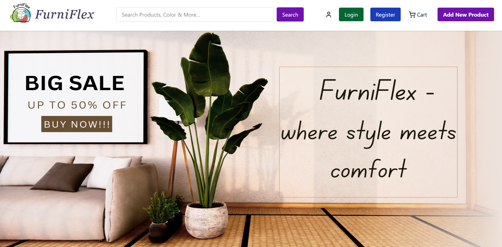
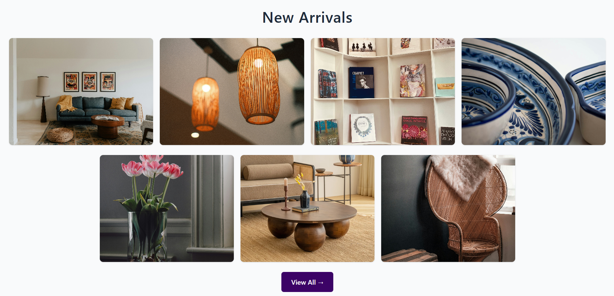
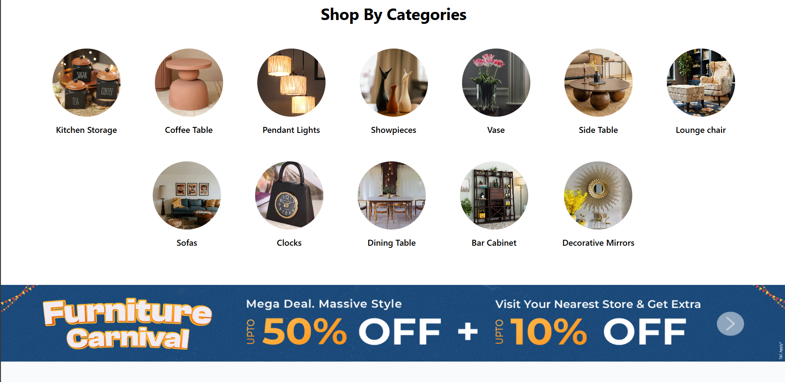

# FurniFlex – Frontend Furniture E-Commerce Application

FurniFlex is a frontend-focused e-commerce web application built using React and Tailwind CSS.
The project demonstrates real-world shopping UI flows such as product browsing, category
navigation, cart management, and a mock checkout experience.

This project is intentionally **frontend-only** and does not include a backend service.

---

## 🚀 Features
- Responsive UI built with Tailwind CSS
- Product listing with category-based navigation
- Search bar with live suggestions
- Add to cart and quantity management
- Cart total calculation using Context API
- Mock checkout / order confirmation flow
- Login & Signup using browser localStorage

---

## 🛠 Tech Stack
- React.js
- Tailwind CSS
- JavaScript (ES6+)
- React Context API
- localStorage

---

## 📸 Screenshots

### Home Page

### Product Listing

### Category

## 🧠 What I Learned
- Structuring scalable React components
- Managing global state using Context API
- Implementing cart and checkout logic on the frontend
- Handling UI-only authentication flows
- Building responsive and user-friendly layouts

---

## ⚠️ Note
This is a **frontend-only project** created to showcase frontend development skills.
No backend APIs or real payment gateway are used.

---

## 📦 How to Run Locally
1. Clone the repository  
2. Run `npm install`  
3. Run `npm start`  

The application will run on `http://localhost:3000`.
